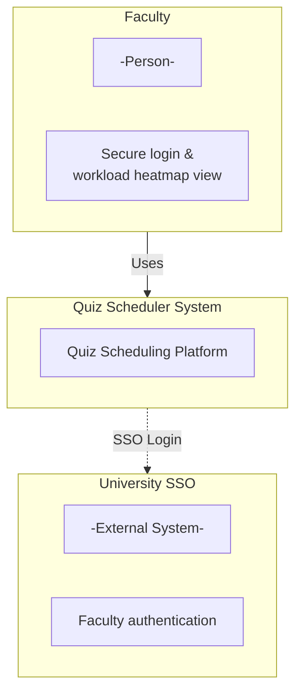
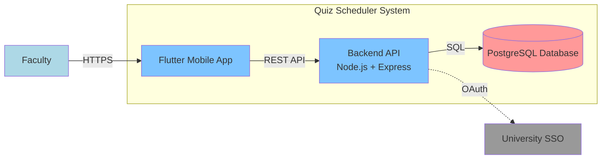
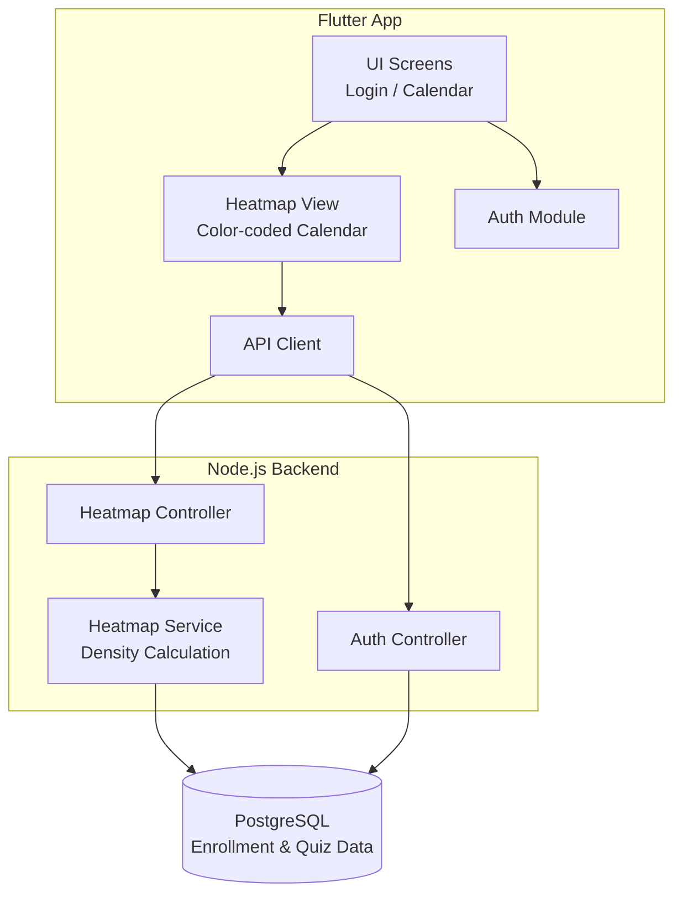

# Tech Stack

**Team Name:** BROCODE-RS
**Sprint:** Sprint 1
**Date:** 10 Feb 2026
**GitHub Repo:** [https://github.com/csf314-2026/docs_BROCODE-RS](https://github.com/csf314-2026/docs_BROCODE-RS)

---

# C4 Model

## LEVEL 1: CONTEXT DIAGRAM (CEO / Stakeholder View)

**Audience:** Non-technical stakeholders (faculty, academic coordinators).

**What it shows:**
Faculty members securely access the Quiz Scheduler platform to visualize student workload density before scheduling evaluations. Authentication is handled using the university-provided SSO system.

---

## LEVEL 2: CONTAINER DIAGRAM (Architect View)

**Audience:** Architects / Dev Leads
**Focus:** Major deployable units

**What it shows:**
The Flutter application communicates with a Node.js backend over HTTPS. The backend authenticates faculty via University SSO and retrieves enrollment data from PostgreSQL to generate the workload heatmap.

---

## LEVEL 3: COMPONENT DIAGRAM (Developer View)

**Audience:** Developers
**Focus:** Internal modules inside each container

**What it shows:**
The Flutter app manages faculty authentication and displays a color-coded calendar heatmap. The backend computes workload density using enrollment data stored in PostgreSQL and serves this data via REST APIs.

---

## LEVEL 4: CODE (Optional)

Skipped. Code-level diagrams are not required at this stage.

---

# Tech Stack Selection Criteria

## Functional Requirements (Sprint 1)

**What must the app do in Sprint 1?**

* Allow faculty to log in securely using university SSO
* Persist authentication state across app restarts
* Display a **color-coded calendar heatmap** (Green / Yellow / Red)
* Visualize student workload density using a provided enrollment dataset
* Enable faculty to identify **low-conflict dates** before scheduling quizzes

❌ **Explicitly excluded in Sprint 1:**

* Student login or dashboards
* Quiz creation, editing, or publishing
* Push notifications or reminders
* Advanced analytics or reporting

---

## Non-Functional Requirements

* **Usability:** Simple, glanceable UI for quick decision-making
* **Performance:** Heatmap loads within 1 second
* **Security:** Access restricted to authenticated faculty only
* **Maintainability:** Modular architecture suitable for a student team

❌ **Eliminates:**

* Microservices architecture
* Separate native Android and iOS apps
* Real-time or streaming systems

---

## Team Capability

🛠️ **Skills available:**

* Programming: JavaScript, Python, introductory Flutter
* Backend: Node.js with REST APIs
* Databases: SQL fundamentals
* Mobile development aligned with course objectives

✅ **Chosen Stack:**

* **Frontend:** Flutter (single cross-platform codebase)
* **Backend:** Node.js + Express
* **Database:** PostgreSQL
* **Authentication:** University SSO (OAuth-based)

---

## Budget & Infrastructure

💰 **Estimated yearly cost: ₹0**

* **Backend hosting:** Free-tier platforms (Render / Railway)
* **Database:** PostgreSQL free tier or self-hosted
* **Authentication:** University-provided SSO
* **Development tools:** GitHub, Flutter SDK, VS Code

➡️ **Total Cost:** **₹0 per year**
✔️ Entire system operates within free-tier and institute-provided resources
✔️ No paid services required for any sprint

---

## Market Maturity & Support

* **Flutter:** Backed by Google with a strong developer ecosystem
* **Node.js:** Industry-standard backend runtime
* **PostgreSQL:** Mature, reliable, open-source database

➡️ All selected technologies are stable, well-supported, and widely used.

---

## Migration & Technical Debt

**Planned evolution beyond Sprint 1:**

* **Sprint 2:** Student login and quiz publishing
* **Sprint 2–3:** Heatmap enhancement using live quiz data
* **Sprint 3:** Push notifications and reminders
* **Sprint 4:** Calendar sync and audit logs

The architecture is intentionally kept simple in Sprint 1 to minimize technical debt while allowing smooth feature expansion in later sprints.

---
