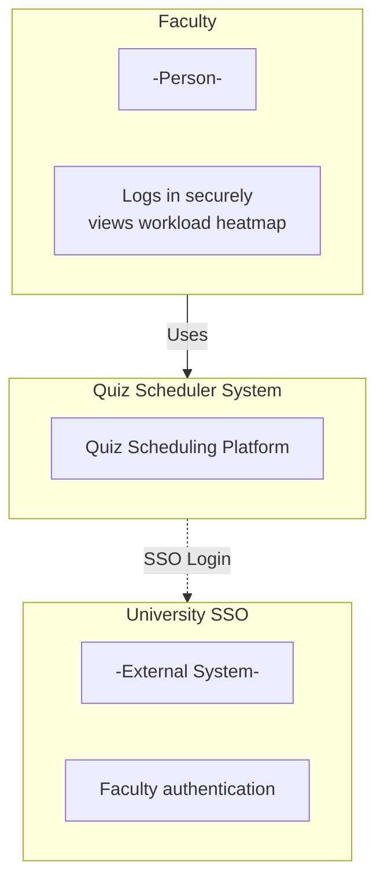
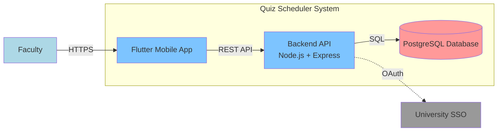
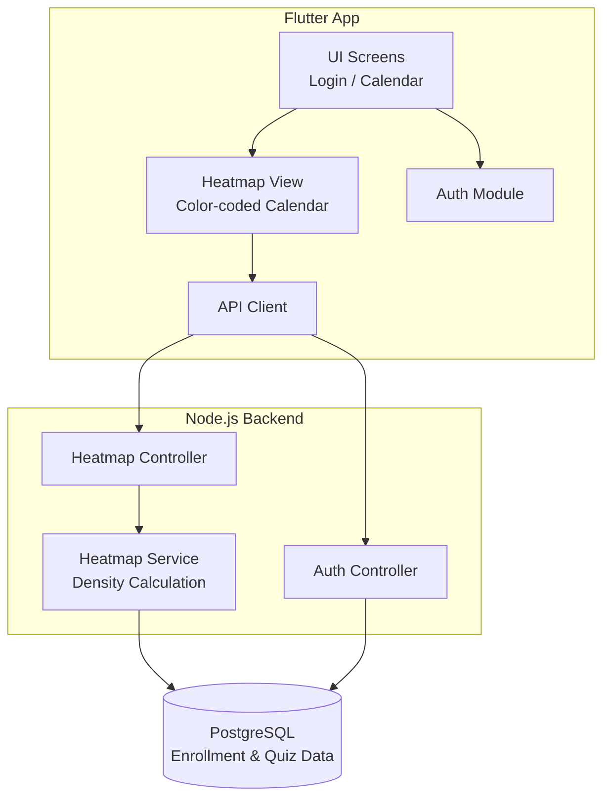

# Tech Stack

**Team Name:** Quiz Scheduler – Group 0
**Sprint:** Sprint 1
**Date:** 12 Feb 2026
**GitHub Repo:** `https://github.com/csf314-2026/docs_BROCODE-RS`

---

# C4 Model

## LEVEL 1: CONTEXT DIAGRAM (CEO / Stakeholder View)

**Audience:** Non-technical stakeholders (faculty, academic coordinators).

**What it shows:**
Faculty members use the Quiz Scheduler platform to securely log in and visualize student workload density before scheduling evaluations. Authentication is handled by the university SSO system.

---

## LEVEL 2: CONTAINER DIAGRAM (Architect View)

**Audience:** Architects / Dev Leads
**Focus:** Major deployable units

**What it shows:**
The Flutter app communicates with a Node.js backend over HTTPS. The backend authenticates faculty using University SSO and retrieves workload data from PostgreSQL to power the calendar heatmap.

---

## LEVEL 3: COMPONENT DIAGRAM (Developer View)

**Audience:** Developers
**Focus:** Internal modules inside each container

**What it shows:**
The Flutter app handles faculty authentication and displays a calendar heatmap. The backend computes workload density from enrollment data and returns color-coded results to the app.

---

## LEVEL 4: CODE (Optional)

Skipped for now. Code-level diagrams are not required at this stage.

---

# Tech Stack Selection Criteria

## Functional Requirements (Sprint 1)

**What must the app do in Sprint 1?**

* Allow faculty to log in securely using university SSO
* Persist authentication state across app restarts
* Display a **color-coded calendar heatmap** (Green / Yellow / Red)
* Visualize student workload density using a provided enrollment dataset
* Help faculty identify **low-conflict dates** before scheduling quizzes

❌ **Eliminates (Sprint 1):**

* Student login or dashboards
* Quiz creation, publishing, or editing
* Notifications or reminders
* Advanced analytics or reporting

---

## Non-Functional Requirements

* **Usability:** Simple, glanceable UI for faculty decision-making
* **Performance:** Heatmap loads within 1 second
* **Security:** Access restricted to authenticated faculty only
* **Maintainability:** Clean architecture suitable for student teams

❌ **Eliminates:**

* Microservices architecture (overkill)
* Native Android + iOS apps separately
* Complex real-time systems

---

## Team Capability

🛠️ **Skills available:**

* Programming: JavaScript, Python, basic Flutter
* Backend: Node.js and REST APIs
* Databases: SQL fundamentals
* Mobile development aligned with course objectives

✅ **Chosen Stack:**

* **Frontend:** Flutter (single codebase, course-aligned)
* **Backend:** Node.js + Express
* **Database:** PostgreSQL
* **Authentication:** University SSO (OAuth-based)

---

## Budget & Infrastructure

💰 **Estimated yearly cost:**

* Backend hosting (Render / Railway / DigitalOcean): ₹0–1000
* PostgreSQL (Free tier / self-hosted): ₹0
* University SSO: Free
* Development tools (GitHub, Flutter SDK): Free

➡️ **Total:** ~₹0–₹12,000 per year
✔️ Feasible for a university project

---

## Market Maturity & Support

* **Flutter:** Backed by Google, strong ecosystem
* **Node.js:** Industry-standard backend runtime
* **PostgreSQL:** Mature, open-source, highly reliable

➡️ All technologies are stable, well-supported, and widely adopted.

---

## Migration & Technical Debt

**Planned evolution beyond Sprint 1:**

* Sprint 2: Student login and quiz publishing
* Sprint 2/3: Enhanced heatmap using live quiz data
* Sprint 3: Push notifications and reminders
* Sprint 4: Calendar sync and audit logs

Architecture is intentionally simple in Sprint 1 to minimize technical debt while enabling smooth feature expansion.

---

