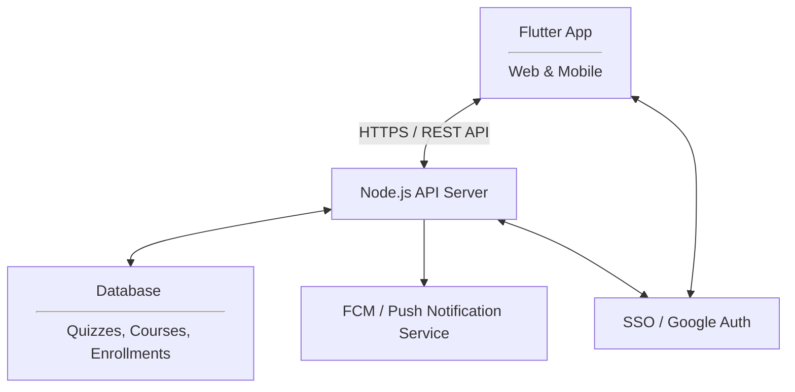

# App Requirements

**Project Name: Quiz Scheduler**

**Team Members & Roles:**

1. Rishabh Sahu : SPOC
2. Apoorv Dubey : Scrum Master
3. Parth Langar : Lead Developer
4. Gaurav Srinivas : UX/Documentation
5. Abhinandan Jain : Quality and Testing

**Stakeholder Name & Contact: Prof Arun Raman (araman@goa.bits-pilani.ac.in)**

**Submission Date:**  2026-01-27

## 1. Problem Statement

Currently, faculty members schedule quizzes independently, often leading to "evaluation clusters" and clashing quiz timings for students enrolled in multiple courses across departments, where students face multiple high-stakes assessments on a single day. This lack of cross-departmental visibility causes significant student burnout and suboptimal academic performance. There is no centralized system to visualize student workload before a quiz is finalized.

## 2. Stakeholders & Users

| Stakeholder Type | Name / Role | Key Goals | Constraints |
|------------------|-------------|-----------|-------------|
| Primary User     | Faculty / Professors |  Schedule quizzes without clashes; view student availability.  |  Must be faster than manual email coordination.  |
| Secondary User   | Students | View an aggregated timeline of all upcoming evals. |  Privacy: Should only see their own course evals.  |
| Administrator   | Academic Admin | Oversee department-wide evaluation density. | Data Security: Need to verify data about the enrolments into courses. |

## 3. User Personas

### Persona 1: Prof Arun - Professor Department of EEE 

- Role/Context: Course Instructor for a 300-student EEE course.
- Background: Wants to maintain high standards but notices student performance drops when they have other midterms on the same day.
- Goals: Find the "path of least resistance" for a quiz date.
- Tech Comfort: Moderate; prefers clean, web-based dashboards.
- Device & Connectivity: Has a good internet connection and multiple devices on various platforms.
- Pain Point: Receiving dozens of emails from students asking to reschedule because of "clashes."

### Persona 2: Ram - Student at BITS Pilani KK Birla Goa Campus

- Role/Context: 2nd Year Engineering Student taking 8 courses.
- Background: Balances club activities with a heavy academic load.
- Goals: To see all deadlines in one place to plan study sessions.
- Tech Comfort: High; expects mobile-friendly views and notifications.
- Device & Connectivity: Has a Laptop and a smartphone with good internet access.
- Pain Point: Finding out about a "surprise" or newly scheduled quiz only 48 hours in advance. Also has to coordinate with professors about quiz clashes.

### Persona 3: Academic Admin – System Manager
- Role/Context: Manages student enrollment and course data
- Background: Works with institutional systems (ERP/LMS)
- Goals: Maintain accurate, secure enrollment data and Control access to sensitive information
- Tech Comfort: High
- Device & Connectivity: Desktop system; secure network
- Pain Point: Preventing unauthorized access or data misuse

## 4. Core User Scenarios

### Scenario 1: Scheduling a Quiz 

- When: Two weeks before the intended quiz date, in the professor's office.
- Who: Prof Arun
- Goal: Select a Tuesday slot that doesn't overlap with already scheduled quizes of other CDCs and electives.

Steps:  

1. Logs in and selects "Create New Quiz."
2. Selects his course "CS F301" and the specific student section.
3. The app displays a Calendar Heatmap. Tuesday the 10th is "Red" (2 quizzes already scheduled). Wednesday the 11th is "Green" (0 quizzes).
4. Selects Wednesday, enters the time (4:00 PM), and hits "Publish."
(Add more if required.)

Why this matters: It prevents the professor from unintentionally causing a student "meltdown" and reduces the need for rescheduling later.

### Scenario 2: Student viewing upcoming quizzes

- When: At the start of the week
- Who: Ram (Student)
- Goal: Understand upcoming academic workload

Steps:

1. Student logs in.
2. Views a consolidated list/calendar of quizzes.
3. Identifies busy days.

Why this matters: Helps students plan study time and reduce anxiety.

### Scenario 3: Admin importing enrollment data

- When: At the beginning of a semester
- Who: Academic Admin
- Goal: Ensure correct course-student mappings

Steps:

1. Admin uploads enrollment data.
2. System validates and stores the data securely.
3. App updates access and visibility accordingly.

Why this matters: Ensures accuracy and data privacy across the system.

## 5. Functional Requirements (User Stories)

### Story 1 (High): Instructor Authentication

Instructors can securely log into the app using their institutional Google accounts to access their personalized dashboard.

Acceptance Criteria:

- [ ] Given the login page, when the instructor clicks "Sign in with Google" and provides valid @bits-goa.ac.in (or relevant domain) credentials, then the system authenticates the user and redirects them to the Faculty Home Page.

- [ ] Given a successful login, when the Home Page loads, then the instructor sees a dashboard populated with only the courses they are currently assigned to teach.

- [ ] Given a user attempts to log in with a non-institutional or invalid Google account, when authentication is processed, then the system denies access and displays an "Unauthorized Domain" error message.

- [ ] Given an active session, when the instructor selects "Logout," then the session is terminated and the user is redirected back to the public landing page.

### Story 2 (High): Dashboard Visualization

As a professor, I want to see a calendar view of my students' existing quizzes so that I can identify free slots.

Acceptance Criteria:  

- [ ] Given a selected student section, when I view the calendar, then I should see color-coded indicators of quiz density per day.

### Story 3 (High): Quiz Creation
As a professor, I want to input quiz details (Date, Time, Duration, Venue) to the system.

Acceptance Criteria:

- [ ] Given valid details, when I click 'Submit', then the event is saved and visible to all associated students and faculty.

### Story 4 (Med): Conflict Alert
As a professor, I want the system to warn me if I try to schedule a quiz on a day that already has 2+ evaluations.

Acceptance Criteria:

- [ ] Given a date with 2 existing evals, when I attempt to save a 3rd, then a warning pop-up appears.

### Story 5 (High): Secure Student Login
As a student, I want to log in using my university email ID so that I can access my personalized schedule securely.

Acceptance Criteria:

- [ ] Given the login page, when the user clicks "Continue with Google," then they are redirected to the Google OAuth 2.0 interface.
- [ ] Given a successful Google login, when the email domain matches @bits-goa.ac.in (or similar), then the user is granted access to their specific dashboard.
- [ ] Given a first-time login, when the account is verified, then the system automatically creates a profile linked to that Google ID.

### Story 6 (High): Student Personal Timeline
As a student, I want to see an aggregated list of quizzes only for the courses I am registered in.

Acceptance Criteria:

- [ ] Given a student login, when they open the app, then they see a chronological list of their specific upcoming quizzes.

### Story 7 (High): Real-time Notification for New Quizzes
As a student, I want to receive an immediate notification when a new quiz is scheduled for one of my courses.

Acceptance Criteria:

- [ ] Given a professor publishes a new quiz, when the transaction is finalized, then all students registered in that course section receive a push notification.
- [ ] Given the notification is clicked, when the app opens, then it navigates directly to that specific quiz's details.

### Story 8 (High): Next-Day Evaluation Reminders
As a student, I want to receive a summary notification of the quizzes I have the next day so I can finalize my preparation.
Acceptance Criteria:

- [ ] Given the current time is 8:00 PM, when the system checks for quizzes occurring the following day, then it sends a "Daily Summary" notification to the student.
- [ ] Given the notification is clicked, when the app opens, then it navigates directly to that specific quiz's details.
- [ ] Given no quizzes are scheduled for the next day, when the system checks, then no notification is sent.

### Story 9 (High): : Quiz Rescheduling & Detail Modification
As a professor, I want to edit the details of a scheduled quiz (date, time, or description) so that I can accommodate changes in the academic schedule.

- [ ] Given an existing quiz entry, when the organizing professor selects "Edit," then all fields (Date, Time, and Description) become modifiable.
- [ ] Given a change in Date or Time, when the professor saves the update, then the Student Burden Heatmap is automatically recalculated for the new and old dates.
- [ ] Given any change to the quiz details, when the professor clicks "Update," then the system must automatically trigger a "Revision Alert" to all enrolled students.

### Story 10 (High): : Change Log & History
As a student, I want to see what specific details were changed in a rescheduled quiz so that I don't get confused by the update.

- [ ] Given a modified quiz, when a student views the quiz details, then the app highlights the changed fields (e.g., the old time is struck through and the new time is shown in red).
- [ ] Given a major reschedule (change of date), when the notification is sent, then the message body explicitly states: "Date changed from [Old Date] to [New Date]."

### Story 11 (Low): Export to Calendar
As a user, I want to sync these quizzes to my Google/Outlook calendar.

Acceptance Criteria:

- [ ] Given a quiz entry, when I click 'Sync', then an .ics file is generated or a direct API sync is triggered.

## 6. Non‑Functional Requirements

| Attribute      | Requirement | Rationale |
|----------------|-------------|-----------|
| Performance    |      Calendar should load in < 2 seconds.       |     Professors will stop using it if it's slow during meetings.      |
| Reliability    |      99 % uptime during mid-term and end-term weeks.      |     Critical periods where scheduling is most frequent.      |
| Security       |      Only authenticated faculty can edit/add quizzes.       |     Prevent unauthorized changes or "prank" quiz entries.      |
| Accessibility  |      Mobile-friendly UI       |      Faculty on the move     |
|Scalability| Support multiple departments |	Future expansion |
| Usability |	Minimal steps for key tasks |	Busy faculty users |

## 7. Out of Scope

1. Grading/LMS: The app will not host quiz questions or store grades.

2. Attendance: No tracking of student attendance during the quiz.

3. Proctoring: No features for online exam monitoring.

4. Venue Booking: The app shows the venue but does not handle the physical booking/locking of classrooms.

5. Direct student communication or messaging

## 8. High‑Level Architecture
The Quiz Scheduler will utilize a Flutter frontend to deliver a dual-experience: a responsive Web Dashboard for faculty (eliminating the need for downloads) and a Native Mobile App for students to leverage push notifications. The backend will follow a serverless or microservices pattern to ensure scalability during peak enrollment periods.

- **Frontend:** Flutter (Web & Mobile) for a unified codebase.
- **Backend:** Node.js (Express) or Firebase Cloud Functions to handle business logic and scheduling calculations.
- **Database:** PostgreSQL or Cloud Firestore to manage relational data between students, courses, and quiz timestamps.
- **Notifications:** Firebase Cloud Messaging (FCM) for real-time alerts and automated cron-job reminders.
- **Auth:** Google OAuth 2.0 / Firebase Auth integrated with University SSO for secure, domain-restricted access.

## 9. Success Metrics

By the end of the course:

- [ ] Faculty Autonomy: faculty users can successfully log in, create a quiz, and reschedule it via the Web UI without manual database intervention..
- [ ] Visual Conflict Resolution: The "Heatmap" correctly identifies and displays high-density evaluation days based on real student enrollment data.
- [ ] Notification Reliability: Students receive automated "Next-Day" reminders and "New Quiz" alerts with a latency of less than 5 minutes from the time of scheduling.
- [ ] Secure Access: Successful implementation of SSO/JWT-based authentication that restricts data visibility so students only see quizzes for their registered courses.

### 10. Glossary

| Term              | Definition                                                                  |
|-------------------|-----------------------------------------------------------------------------|
| Evaluation Cluster        | A period where multiple assessments overlap, causing high student stress. |
| Heatmap           | A visual calendar interface where colors (Green to Red) indicate the density of quizzes scheduled for a specific group of students.              |
| SSO       | Single Sign-On; a session/user authentication service that permits a user to use one set of login credentials (e.g., University Email).            |
| Push Notification | A message that pops up on a mobile device. In this app, these are triggered via Firebase Cloud Messaging (FCM) to alert students of new quizzes or upcoming deadlines even when the app is not actively open.            |
