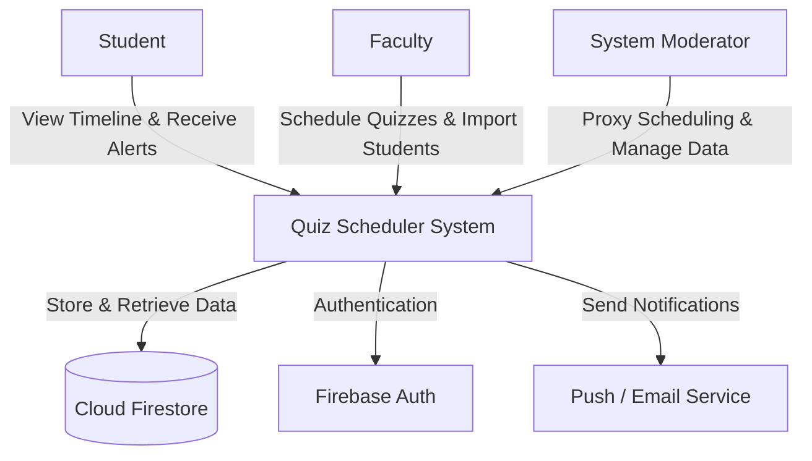
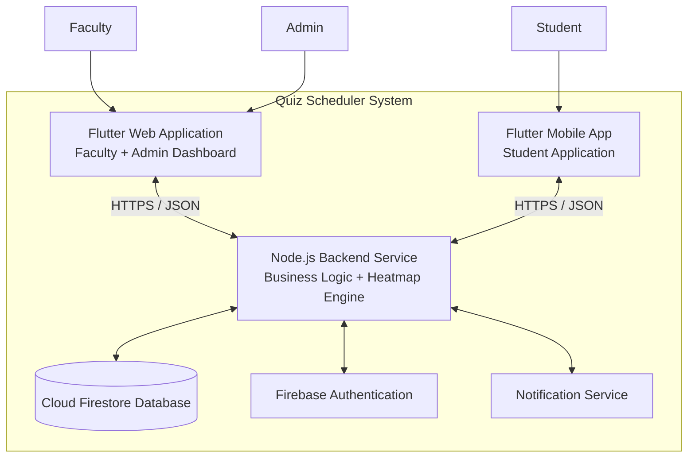
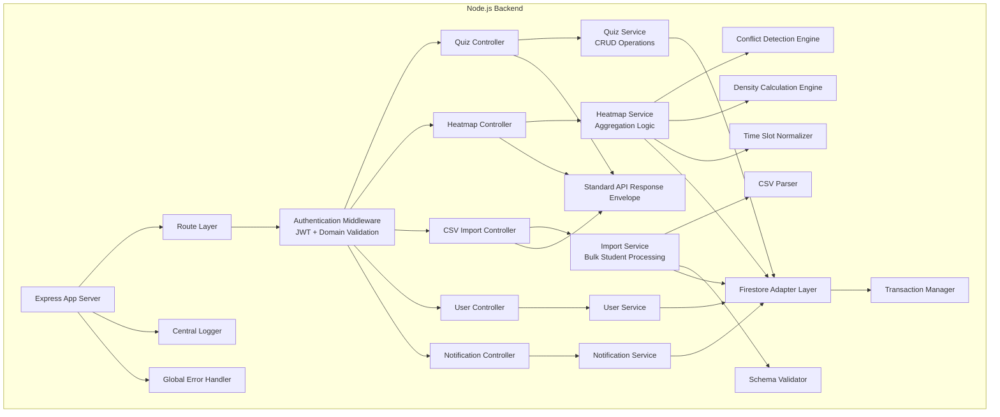
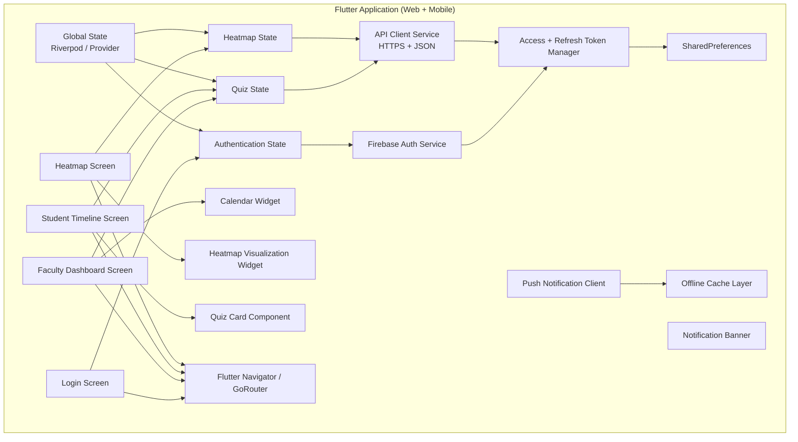

# Tech Stack

**Team Name:** BROCODE-RS
**Sprint:** Sprint 1
**Date:** 10/02/2026
**GitHub Repo:** [Github](https://github.com/csf314-2026/docs_BROCODE-RS.git)

---

# C4 Model

---

## LEVEL 1: CONTEXT DIAGRAM (CEO / Stakeholder View)

**Audience:** Non-technical stakeholders
**Focus:** Who uses the system and what external systems it depends on.

### What it shows

The **Quiz Scheduler System** acts as the central coordination layer:

* **Students** view their personalized quiz timelines and receive alerts.
* **Faculty** create and manage quizzes and import student data.
* **Admins** oversee scheduling and perform proxy operations when required.
* The system depends on:

  * **Cloud Firestore** for persistent storage.
  * **Firebase Auth** for secure authentication and domain restriction.
  * **Push/Email services** for notifications.

This view avoids technical complexity and communicates value clearly to stakeholders.

---

## LEVEL 2: CONTAINER DIAGRAM (Architect View)

**Audience:** Architects / Dev Leads
**Focus:** Major deployable units and how they interact.

### What it shows

The system is separated into clear deployable containers:

### 1️⃣ Flutter Web

* Used by Faculty and Admin.
* Provides scheduling dashboard and heatmap visualization.

### 2️⃣ Flutter Mobile

* Used by Students.
* Displays timeline and sends push notifications.

### 3️⃣ Node.js Backend

* Central business logic.
* Handles scheduling, validation, heatmap generation, and imports.
* Ensures consistent API response structure.

### 4️⃣ Firebase Services

* **Firestore** → NoSQL cloud database.
* **Firebase Auth** → Secure SSO + domain restriction.
* **Notification Service** → Push/email alerts.

This separation ensures scalability and clean architectural boundaries.

---

## LEVEL 3: COMPONENT DIAGRAM (Developer View)

**Audience:** Developers
**Focus:** Internal modules inside each container.

---

### 🔹 Node.js Backend – Internal Components

---

### 🔹 Flutter Application – Internal Components

---

### What This Level 3 Shows

* Clear **layered backend architecture**

  * Router → Middleware → Controllers → Services → Engines → Firestore
* Dedicated **Heatmap computation engines**
* Explicit **validation + response envelope**
* Centralized **logging and error handling**
* Clean Flutter separation:

  * UI Layer
  * State Layer
  * Service Layer
  * Persistence Layer
  * Navigation Layer
* Prepared for:

  * Offline caching
  * Token refresh
  * Future scalability
  * Feature expansion (venue booking, analytics, reports)

---

# Tech Stack Selection Criteria

---

## Functional Requirements

The system must:

* Allow faculty to schedule quizzes.
* Import student data via CSV.
* Generate evaluation heatmaps using aggregated data.
* Provide students with personalized timelines.
* Send notifications for upcoming quizzes.

❌ Eliminated:

* Static HTML-only systems.
* Backend-less client-side aggregation.
* SQL-only rigid schema systems.

---

## Non-Functional Requirements

* Persistent login with refresh tokens.
* 99% uptime during peak exam weeks.
* Strict `@bits-goa.ac.in` domain restriction.
* Secure data isolation between departments.

❌ Eliminated:

* Guest login systems.
* Fully on-device scheduling logic.

---

## Team Capability

* Strong foundation in OOP & SQL.
* Familiarity with JavaScript ecosystem.
* Willingness to learn Flutter & Firebase.

✅ Selected:

* **Frontend:** Flutter (Web + Mobile)
* **Backend:** Node.js (Express)
* **Database:** Cloud Firestore
* **Auth:** Firebase Authentication

---

## Budget & Infrastructure

💰 Estimated Cost: ₹0 (Spark Plan)

* Serverless Firebase infrastructure.
* Minimal DevOps overhead.
* Scalable architecture without upfront hosting cost.

---

## Market Maturity & Support

* **Flutter:** Mature cross-platform framework with strong plugin ecosystem.
* **Node.js:** Large ecosystem for REST APIs, CSV parsing, authentication.
* **Firebase:** Reliable cloud-managed backend services.

---

## Migration & Technical Debt Strategy

* Business logic isolated in Node.js (not embedded in Firestore).
* Clean service-based backend design.
* Modular Flutter architecture.
* Easily migratable to AWS or private BITS infrastructure if needed.

