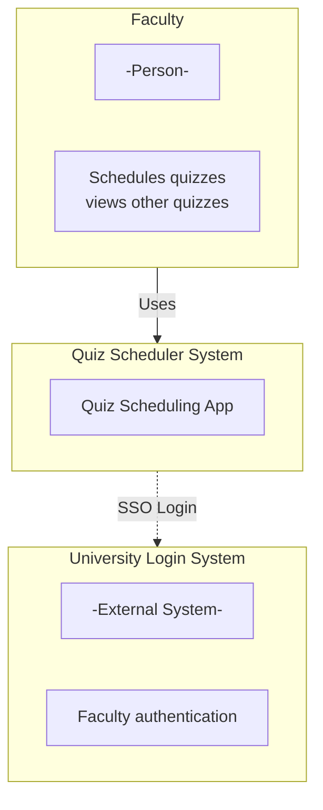
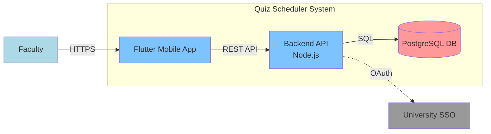
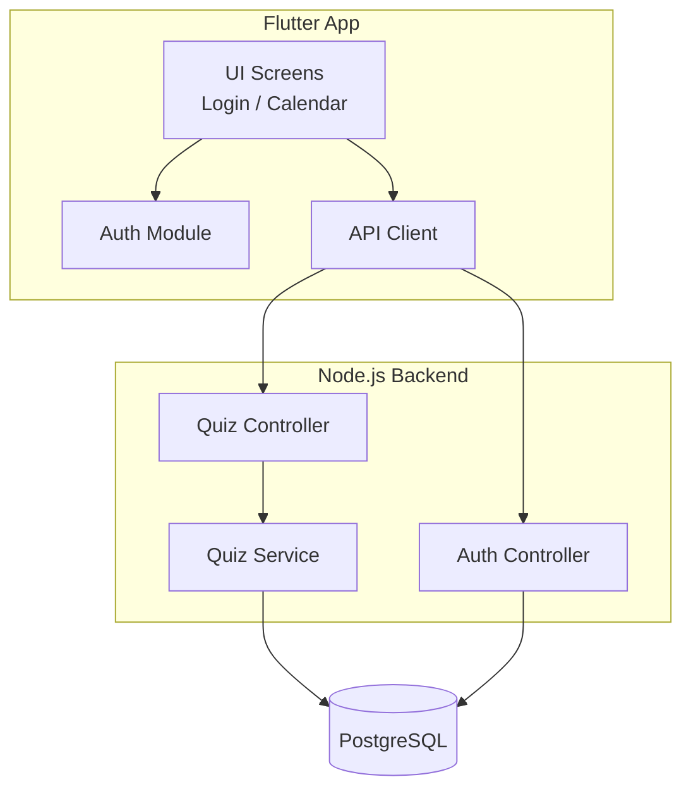

# Tech Stack

**Team Name:** Quiz Scheduler – Group 0
**Sprint:** Sprint 1
**Date:** 12 Feb 2026
**GitHub Repo:** `<add your repo URL here>`

---

# C4 Model

## LEVEL 1: CONTEXT DIAGRAM (CEO / Stakeholder View)

**Audience:** Non-technical stakeholders (faculty, course staff).

**What it shows:**
Faculty use the Quiz Scheduler app to add and view quizzes. Authentication is handled via the university login system.

---

## LEVEL 2: CONTAINER DIAGRAM (Architect View)

**Audience:** Architects / Dev Leads.
**Focus:** Major deployable units.

**What it shows:**
The Flutter app communicates with a Node.js backend, which stores quiz data in PostgreSQL and authenticates users via University SSO.

---

## LEVEL 3: COMPONENT DIAGRAM (Developer View)

**Audience:** Developers.

**What it shows:**
Internal modules inside the mobile app and backend, and how quiz data flows from UI → API → database.

---

## LEVEL 4: CODE (Optional)

Skipped for now (not required at this stage).

---

# Tech Stack Selection Criteria

## Functional Requirements

**What must the app do (Sprint 1)?**

* Faculty login using university credentials
* Add quiz date, time, and course
* View all scheduled quizzes (conflict awareness)
* Simple calendar / list view

❌ **Eliminates:**

* Student login (not needed in Sprint 1)
* Real-time chat / notifications (future scope)
* Heavy analytics frameworks

---

## Non-Functional Requirements

* **Usability:** Simple UI usable by faculty
* **Performance:** Quiz data loads instantly
* **Security:** Only faculty can log in
* **Maintainability:** Easy for student team to extend

❌ **Eliminates:**

* Microservices (overkill)
* Blockchain / event streaming (irrelevant)
* Native Android + iOS separately (high effort)

---

## Team Capability

🛠️ **Skills available:**

* Programming: JavaScript, Python, basic Flutter
* Backend: Node.js familiarity
* Databases: SQL basics
* Mobile dev: Learning Flutter (course-aligned)

✅ **Chosen Stack:**

* **Frontend:** Flutter (cross-platform, course-relevant)
* **Backend:** Node.js + Express
* **Database:** PostgreSQL
* **Auth:** University SSO (OAuth-based)

---

## Budget & Infrastructure

💰 **Estimated yearly cost:**

* Backend hosting (Render / Railway / DO): ₹0–1000
* Database (Free tier PostgreSQL): ₹0
* Auth (University SSO): Free
* Tools (GitHub, Flutter SDK): Free

➡️ **Total:** ~₹0–₹12,000/year
✔️ Feasible for a university project

---

## Market Maturity & Support

* **Flutter:** Backed by Google, strong community
* **Node.js:** Industry standard backend runtime
* **PostgreSQL:** Reliable, open-source, widely used

➡️ All technologies clearly mature and well-supported.

---

## Migration & Technical Debt

**Planned future evolution:**

* Add student read-only access (Sprint 2)
* Add conflict heatmap visualization (Sprint 2/3)
* Push notifications for quiz reminders (future)
* Scale backend if users increase

Design kept simple now to avoid premature complexity.

---

