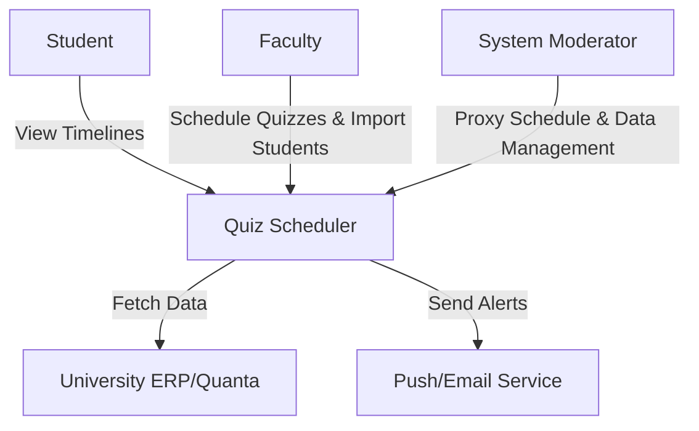
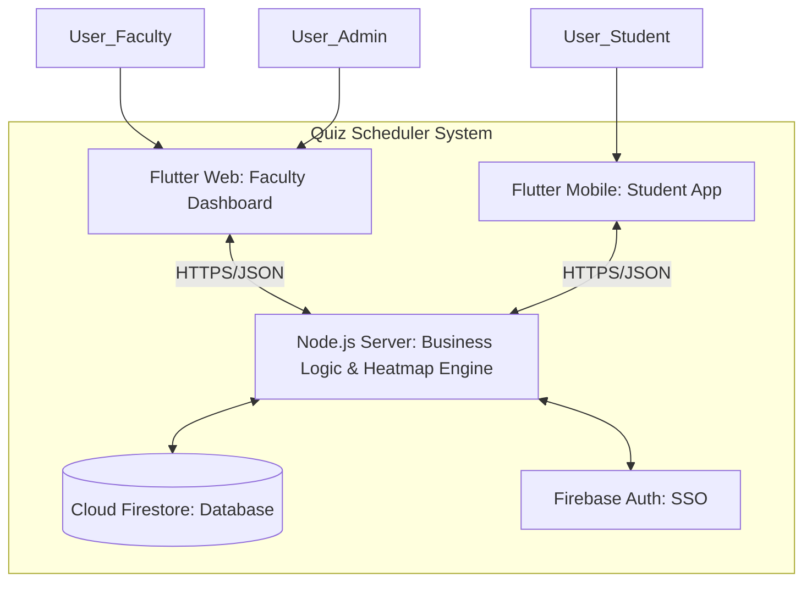
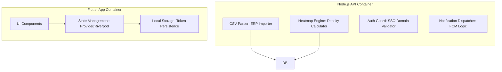

# Tech stack

**Team Name:** BROCODE-RS 
**Sprint:** Sprint 1  
**Date:** 10/02/2026  
**GitHub Repo:** [[Github](https://github.com/csf314-2026/docs_BROCODE-RS.git)]

## C4 Model

### LEVEL 1: CONTEXT DIAGRAM (CEO/Stakeholder View)

**Audience:** Non-technical people.

**What it shows:** (The Quiz Scheduler system as a central hub interacting with three primary users (Faculty, Students, Admins) and the external University ERP (Quanta) for student enrollment data.)>

### LEVEL 2: CONTAINER DIAGRAM (Architect View)

**Audience:** Architects/Dev Leads. **Major deployable units.**

**What it shows:** The high-level technical building blocks, separating the user-facing Flutter applications from the data management and logic layers.

### LEVEL 3: COMPONENT DIAGRAM (Developer View)

**Audience:** Developers. **Modules/services inside each container.**

**What it shows:** The internal breakdown of logic, such as the CSV parser for student imports and the heatmap engine for conflict detection.

<!-- ### Level 4: Code (Optional, Implementation Teams)

**Audience:** Specific dev teams. **Classes/package structure.** (Skip for now.) -->

## Tech Stack Selection Criteria

### Functional Requirements

What must the app do?

- Heatmap Logic: Requires a server-side logic layer to aggregate student schedules across departments to find "Evaluation Clusters."

- Cross-Platform Access: Faculty require a no-install Web Dashboard; Students require a native-feel mobile app for notifications.

❌ Eliminates: Plain HTML/JS (Too complex for cross-platform), SQL-only DBs (Fixed schemas make rapid student data changes difficult).

### Non-Functional Requirements

- Persistence: Must keep students logged in via Refresh Tokens.

- Reliability: 99% uptime during peak mid-term weeks.

- Security: Strict @bits-goa.ac.in domain restriction for all users.

❌  Eliminates: Guest-access auth (Too high a security risk for academic data).

### Team Capability

🛠️ **Skills & Growth Mindset:**
* **Adaptability:** The team consists of solid learners committed to mastering the required tech stack (Flutter, Node.js, Firebase) during the implementation phase.
* **Core Strengths:** Strong foundational knowledge in logic and system design, with specific leads assigned to research and prototype each layer of the stack.
* **Continuous Learning:** Weekly knowledge-sharing sessions are planned to bridge

✅ Choose:Flutter & Firebase as the core stack.

### Budget & Infrastructure

💰 Cost for year: ₹0

- Hosting/DB: Utilizing Firebase Spark Plan (Free Tier).
- Infrastructure: Serverless approach reduces maintenance overhead.

