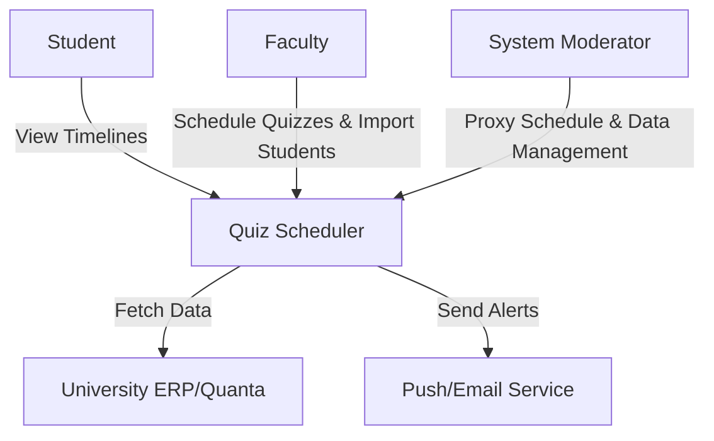
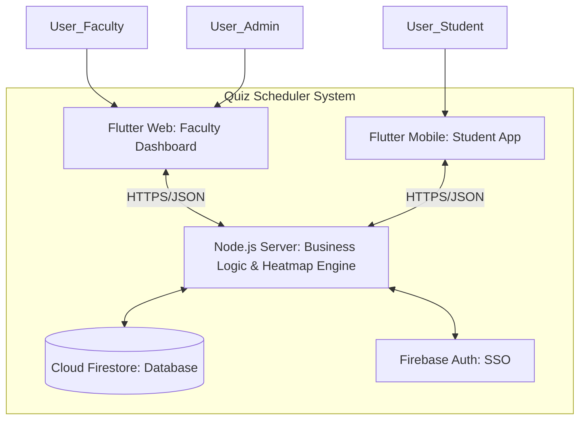
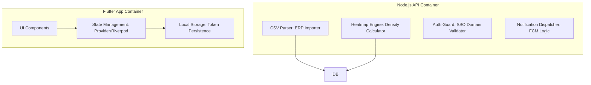

# Tech stack

**Team Name:** BROCODE-RS 
**Sprint:** Sprint 1  
**Date:** 10/02/2026  
**GitHub Repo:** [[Github](https://github.com/csf314-2026/docs_BROCODE-RS.git)]

## C4 Model

### LEVEL 1: CONTEXT DIAGRAM (CEO/Stakeholder View)

**Audience:** Non-technical people.

**What it shows:** The Quiz Scheduler system as a central hub interacting with three primary users (Faculty, Students, Admins) and the external University ERP (Quanta) for student enrollment data.

### LEVEL 2: CONTAINER DIAGRAM (Architect View)

**Audience:** Architects/Dev Leads. **Major deployable units.**

**What it shows:** The high-level technical building blocks, separating the user-facing Flutter applications from the data management and logic layers.

### LEVEL 3: COMPONENT DIAGRAM (Developer View)

**Audience:** Developers. **Modules/services inside each container.**

**What it shows:** The internal breakdown of logic, such as the CSV parser for student imports and the heatmap engine for conflict detection.

<!-- ### Level 4: Code (Optional, Implementation Teams)

**Audience:** Specific dev teams. **Classes/package structure.** (Skip for now.) -->

## Tech Stack Selection Criteria

### Functional Requirements

What must the app do?

- Heatmap Logic: Requires a server-side logic layer to aggregate student schedules across departments to find "Evaluation Clusters."

- Cross-Platform Access: Faculty require a no-install Web Dashboard; Students require a native-feel mobile app for notifications.

❌ Eliminates: Plain HTML/JS (Too complex for cross-platform), SQL-only DBs (Fixed schemas make rapid student data changes difficult).

### Non-Functional Requirements

- Persistence: Must keep students logged in via Refresh Tokens.

- Reliability: 99% uptime during peak mid-term weeks.

- Security: Strict @bits-goa.ac.in domain restriction for all users.

❌  Eliminates: Guest-access auth (Too high a security risk for academic data).

### Team Capability

🛠️ **Skills & Growth Mindset:**
- Foundational Knowledge: All team members are familiar with SQL and OOP concepts, providing a strong baseline for database management and software design.

- Core Literacy: Every member is proficient in at least one programming language, ensuring versatility in both backend and frontend tasks.

- Adaptive Learning: The team is committed to learning the specific project tech stack (Flutter, Node.js, Firebase) on an "as-needed" basis during implementation.

-✅ Choose: Flutter & Firebase. While new to the team, these tools align with the team's OOP background and offer a highly learnable ecosystem for rapid prototyping.

### Budget & Infrastructure

💰 Cost for year: ₹0

- Hosting/DB: Utilizing Firebase Spark Plan (Free Tier).
- Infrastructure: Serverless approach reduces maintenance overhead.

### Market Maturity & Support

- Flutter: Backed by Google with a massive ecosystem of plugins (like syncfusion_flutter_calendar) that accelerate development for our specific scheduling needs.
- Node.js: The gold standard for server-side JavaScript with extensive libraries for CSV parsing and secure authentication.
- ✅ Choose: Industry-standard tools ensure that whenever the team hits a "roadblock," a solution is likely available on Stack Overflow or official documentation.

### Migration & Technical Debt

- Data Portability: By using a Node.js middleware for the Heatmap Engine rather than putting logic inside Firebase, we can easily migrate the backend to AWS or a private BITS server in the future.
- Modular Design: Using a clean folder structure ensures that new features (like Venue Booking) can be added later without rewriting the core scheduling logic.
- ✅ Choose: We are prioritizing "Clean Code" principles and documentation early to minimize the debt we might otherwise accrue during the fast-paced 8-week build.